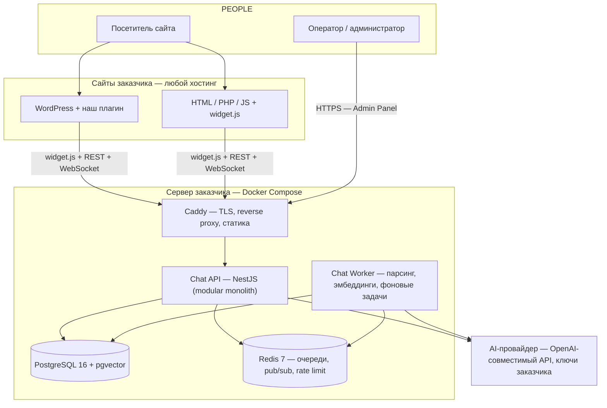

# Обзор проекта

## Краткое содержание

- Продукт и решаемая проблема.
- Целевая аудитория и сценарии.
- Ключевые возможности.
- Ограничения и «чем не является».
- Состав системы и high-level схема.

## 1. Что за продукт и какую проблему решает

**Universal Chat** (рабочее название, TBD) — программный комплекс, который владелец сайта устанавливает **на собственный сервер** и получает:

1. **AI-консультанта**, обученного на знаниях компании (документы, FAQ, цены, услуги) — без программирования.
2. **Живых операторов**, которым AI передаёт диалог, когда вопрос требует человека.
3. **Встраиваемый чат-виджет** для любого сайта: WordPress или чистый HTML/PHP/JS.

**Проблема, которую решаем:** существующие чат-платформы — это SaaS: данные и диалоги клиентов уходят на чужие серверы, есть зависимость от доступности вендора и его тарифов. Продукт даёт те же возможности (AI + операторы + аналитика), но полностью на инфраструктуре заказчика, с его ключами к AI-провайдеру (или локальным LLM).

## 2. Целевая аудитория

| Аудитория | Мотивация |
|---|---|
| Владельцы малых/средних сайтов (магазин, клиника, юристы, автосервис, услуги) | Чат-консультант 24/7 без SaaS-подписки; данные остаются у них |
| Компании с требованиями к приватности данных | Self-hosted, GDPR-friendly, данные не покидают сервер |
| Агентства / интеграторы | Один сервер — много сайтов клиентов (мультипроектность) |
| Разработчики самописных сайтов | Подключение одним `<script>` без изменения кода |

## 3. Ключевые возможности

- **Подключение за минуты:** WordPress-плагин (Install → Configure → Enable) или один `<script>` для чистого сайта.
- **Настройка AI без программирования:** название, язык, тон, описание компании, инструкции, правила поведения — через web-интерфейс.
- **Knowledge Base:** PDF, DOCX, TXT, CSV, Markdown, URL, FAQ, простой текст.
- **RAG с цитатами:** AI отвечает на основе знаний клиента, не выдумывает; указывает источники.
- **Передача оператору:** по просьбе пользователя («позовите менеджера») или автоматически (не знает ответа, жалоба, сложный вопрос, запрос цены).
- **Операторская панель:** очередь диалогов, realtime-ответы, заметки, возврат чата AI.
- **Мультипроектность:** одна установка — несколько проектов/сайтов с изолированными данными, знаниями и операторами.
- **Независимость от AI-провайдера:** интерфейс провайдера; MVP — любой OpenAI-compatible endpoint (включая локальный Ollama).
- **Аналитика:** диалоги, handoff rate, разрешённые AI, латентность ответов.

## 4. Главные ограничения проекта

1. **НЕ SaaS.** Установленная система работает автономно; обязательная инфраструктура вендора отсутствует.
2. **Данные у заказчика:** PostgreSQL на сервере заказчика; ключи AI — заказчика (BYOK).
3. **Платформы v1:** чистый HTML/PHP/JS и WordPress. Прочие CMS — позже, через integration-слой без правки ядра.
4. **Backend — только VPS + Docker.** Shared hosting для backend не поддерживается (сайты при этом могут жить где угодно — см. DOC-016).
5. **AI — внешний API или локальный LLM** через OpenAI-compatible контракт.

## 5. Чем продукт НЕ является

- **Не SaaS и не облако вендора** — нет обязательного внешнего сервера проекта.
- **Не WordPress-плагин с бекендом внутри WP** — WP-плагин только вставляет скрипт; вся логика на отдельном сервере.
- **Не PHP-система для shared hosting** — realtime, RAG-воркеры и pgvector требуют VPS.
- **Не привязка к одному AI** — провайдер заменяемый, включая полностью локальный.
- **Не нишевый бот** — ниша задаётся настройками и знаниями, не кодом.

## 6. Основные сценарии использования

| Сценарий | Поток |
|---|---|
| Интернет-магазин | AI знает товары/цены/доставку/возвраты; запрос индивидуального расчёта → оператор |
| Юридическая компания | AI знает услуги/практики/цены; сложная консультация → оператор |
| Клиника | AI знает услуги/врачей/расписание/правила записи; жалоба → оператор |
| Автосервис | AI знает услуги/запчасти/цены; диагностика по VIN → оператор |
| Мульти_SITE агентство | Одна установка, проекты A/B/C, у каждого свои сайты/знания/операторы |

## 7. Состав системы

```text
САЙТЫ ЗАКАЗЧИКА (любой хостинг)      СЕРВЕР ЗАКАЗЧИКА (VPS + Docker)
WordPress + наш плагин               Caddy (TLS) → Chat API (NestJS)
Чистый HTML/PHP/JS + widget.js       Chat Worker (парсинг, эмбеддинги)
        ↓ только <script>            PostgreSQL + pgvector | Redis
                                      Admin Panel (SPA) | Operator Inbox
                                              ↓
                                      AI-провайдер (ключи заказчика,
                                      опционально локальный Ollama)
```

Компоненты и потоки подробно — в DOC-003. Установка — в DOC-016.

## High-level схема



## Чек-лист понимания продукта

- [ ] Могу объяснить разницу «сайт где угодно / backend на VPS заказчика».
- [ ] Понимаю, что AI-провайдер — на ключах заказчика и заменяем.
- [ ] Знаю два сценария подключения: WP-плагин и `<script>`.
- [ ] Понимаю, что handoff — центральная функция, а не надстройка.

## Частые ошибки понимания

- «Нужно ставить backend на тот же хостинг, что и сайт» — нет, backend на отдельном VPS, сайту достаточно `<script>`.
- «WordPress-плагин содержит чат-движок» — нет, плагин тонкий, вся логика в Chat API.
- «Если наш сервер вендора ляжет, у заказчика чат перестанет» — нет, runtime-зависимости от вендора нет.
- «AI работает только с OpenAI» — нет, любой OpenAI-compatible endpoint, включая локальный Ollama.

## Связанные разделы

- Требования и цели — DOC-002
- Архитектура — DOC-003
- Установка — DOC-016
- Roadmap версий — DOC-025
