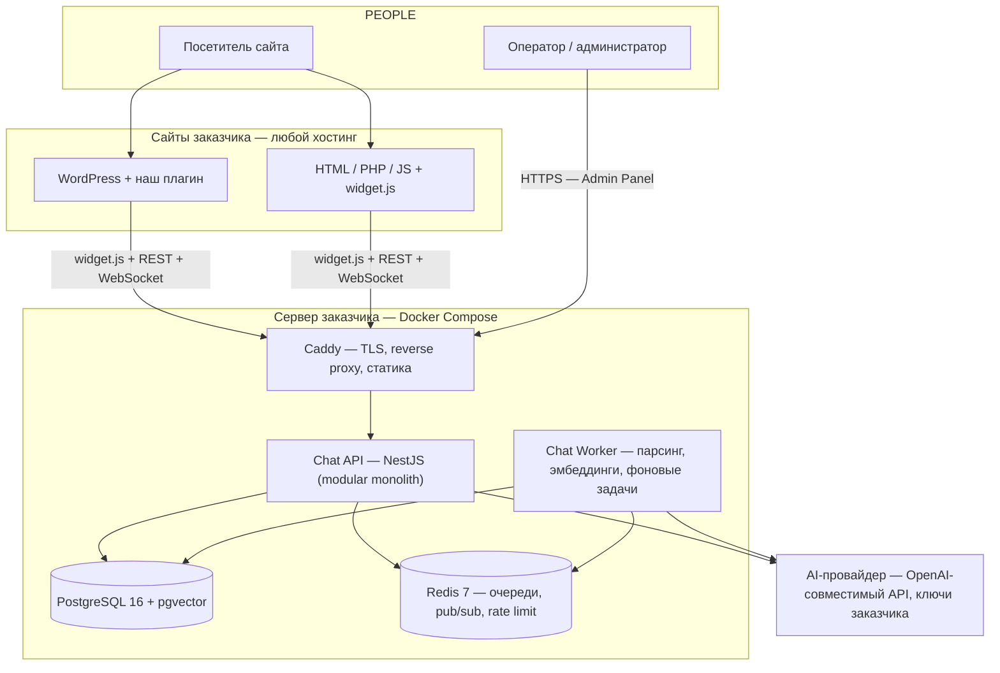

# Системная архитектура

## Краткое содержание

- Общая схема и компоненты.
- Слои и правило зависимостей (Core / Integration).
- Модули ядра и Integration Contract.
- Потоки данных: сообщение, handoff.
- Real-time модель.
- Режимы работы бота и режимы эскалации.
- Self-hosted особенности, внешние зависимости, отключаемые части.
- Минимальная и полная архитектура.

Детали реализации вынесены: backend — DOC-005, БД — DOC-006, API — DOC-007, виджет — DOC-008, AI — DOC-011, знания — DOC-012, операторы — DOC-013, деплой — DOC-016.

## 1. Общая схема



Ключевое свойство топологии: **сайты и backend живут на разных машинах** и не зависят друг от друга по рантайму; единственная внешняя runtime-зависимость — AI-провайдер (заменяемый, включая локальный Ollama).

## 2. Компоненты

| Компонент | Технология | Ответственность | Детали |
|---|---|---|---|
| Chat Widget | Web Component + Shadow DOM, Preact | UI чата на сайте посетителя | DOC-008 |
| WP Plugin | PHP (тонкий) | Настройка + вставка скрипта в WordPress | DOC-009 |
| widget.js | Один ESM-файл | Универсальное встраивание на любой сайт | DOC-008, DOC-010 |
| Chat API | Node.js 20 + NestJS 10 | REST, Socket.IO, conversation engine, статика админки | DOC-005, DOC-007 |
| Chat Worker | Тот же образ, другой entrypoint | BullMQ: парсинг, эмбеддинги, таймеры, бэкапы | DOC-005 |
| Admin Panel | React + Vite SPA | Управление: проекты, сайты, AI, знания, команда | DOC-022 |
| Operator Inbox | Часть Admin Panel | Очередь диалогов, ответы, handoff | DOC-013 |
| PostgreSQL | 16 + pgvector | Реляционные данные + векторы + полнотекст | DOC-006 |
| Redis | 7 | Очереди, pub/sub для WS fanout, rate limit | DOC-005 |
| Caddy | reverse proxy | TLS (авто-HTTPS), проксирование, статика | DOC-016 |
| AI Provider | внешний | LLM + эмбеддинги; OpenAI-compatible контракт | DOC-011 |

## 3. Слои и правило зависимостей

```text
┌────────────────────────────────────────────────────────────────┐
│ INTEGRATION LAYER (заменяемый, платформо-зависимый)            │
│   WordPress Plugin  │  Generic Web (widget.js + SDK)           │
└───────────────┬────────────────────────────────────────────────┘
                │  Integration Contract (раздел 5)
┌───────────────▼────────────────────────────────────────────────┐
│ CORE (платформо-независимый, NestJS modules + чистый TS-домен) │
│  Auth │ Projects │ Sites │ Conversations │ Messages │ Handoffs  │
│  Operators │ Knowledge │ RAG │ AI Providers │ Analytics │ Audit │
└──────┬──────────────────────┬──────────────────────────────────┘
       │                      │
┌──────▼───────┐      ┌───────▼────────┐      ┌─────────────────┐
│ PostgreSQL   │      │ Redis          │      │ LLM/Embeddings  │
│ + pgvector   │      │ очереди/pubsub │      │ (внешн. API)    │
└──────────────┘      └────────────────┘      └─────────────────┘
```

**Правила:**

1. **Core не зависит от WordPress** (и от любой конкретной платформы). WordPress — отдельный integration-слой.
2. Integration-слой знает только Integration Contract, не внутренности Core.
3. Новая платформа = новый пакет в `integrations/`; релиз ядра не требуется.
4. Пустые адаптеры будущих платформ не создаются (архитектурное решение — DOC-026, ADR-007).

## 4. Модули ядра (NestJS)

```text
auth            login, refresh, RBAC, visitor-токены
users           администраторы установки
projects        проекты, участники, роли
sites           сайты, widget keys, widget config, origin allowlist
assistants      настройки AI, правила эскалации
knowledge       документы, FAQ, статусы индексации
rag             ingest pipeline + retrieval (гибридный поиск)
ai              LlmProvider/EmbeddingProvider + guardrails
conversations   state machine, conversation engine
messages        сообщения, seq, цитаты, confidence
handoffs        очередь, принятие, статус
operators       статусы операторов, нагрузка
analytics       метрики из events
realtime        Socket.IO gateway (namespace /widget и /admin)
notifications   email-уведомления (SMTP заказчика)
settings        настройки установки, AI-ключи (шифрованные)
audit           append-only журнал событий
```

Внутренние детали модулей — DOC-005.

## 5. Integration Contract

Три публичных контракта, которые ядро обязано стабилизировать и версионировать. Через них любая платформа подключается без правки ядра:

1. **Widget Bootstrap** — единый `widget.js` + publishable key. Если платформа может вставить `<script>`, она уже поддержана (WordPress, Laravel, React, Vue, Next, Shopify — всем достаточно этого).
2. **Public Widget API v1** — `/widget/v1/*` + Socket.IO namespace `/widget`: для «толстых» интеграций, где виджет встраивается нативно в SPA платформы.
3. **Webhooks + Admin API v1** — `/api/v1/*` для серверных интеграций (webhooks — V2, контракт зафиксирован сейчас).

Пример будущего: `integrations/laravel` — Composer-пакет с Blade-директивой `@chatwidget('pk_...')`; ноль изменений в Core.

## 6. Потоки данных

### 6.1 Сообщение посетителя → ответ AI

```text
1. Валидация (visitor token, rate limit, origin, размер)
2. Персистентность: INSERT message (seq = last_seq + 1)
3. Пуш в комнату диалога (Socket.IO)
4. state = AI_ACTIVE → Conversation Engine:
   a. Retrieval: гибридный поиск по KB проекта (вектор + полнотекст)
   b. Guardrails: порог релевантности, denied topics
   c. LLM: system + persona + контекст + история → стриминг токенов
   d. Персистентность AI-сообщения (citations, confidence)
   e. Escalation Engine: LLM-сигналы + правила → handoff?
5. state ∈ {WAITING_OPERATOR, OPERATOR_ACTIVE} → AI молчит
```

**Строгий порядок:** сообщение сначала пишется в БД (монотонный `seq`), потом рассылается. Клиент после reconnect догоняет пропущенное через `GET /messages?after_seq=N`.

### 6.2 Handoff AI → оператор

```text
Посетитель: «Позовите менеджера» / сложный вопрос
   → AI-ход (structured output: интенты, confidence)
   → RulesEngine: сработало правило
   → AI прощается, создаётся handoff(reason, rule_id)
   → state = WAITING_OPERATOR, уведомление операторам (WS + email при офлайне)
   → Оператор accept() → state = OPERATOR_ACTIVE
   → Оператор отвечает напрямую; AI отключён
   → Оператор: заметка / вернуть AI / закрыть (RESOLVED)
```

Диаграммы-последовательности и state machine — DOC-013 (источник истины по жизненному циклу диалога).

## 7. Real-time модель (кратко)

- Транспорт: **Socket.IO** (WebSocket + авто-fallback на long-polling), единый для виджета и операторской панели.
- Комнаты: `conversation:{id}` в namespace `/widget` и `/admin`; `project:{id}` для списков и уведомлений.
- Стриминг AI: токены летят в комнату как `ai_token`; финальное сообщение (цитаты, confidence) персистится и рассылается как обычное `message`.
- Надёжность: seq-нумерация, кэтч-ап `?after_seq=N`, idempotency-key на POST, typing-события с TTL.
- Масштабирование: Socket.IO Redis adapter — fanout работает при нескольких api-инстансах без изменения кода.

Полный контракт событий — DOC-007.

## 8. Режимы работы бота

| Режим | Условие | Поведение |
|---|---|---|
| AI_ACTIVE (норма) | state диалога AI_ACTIVE | RAG-ответ со стримингом и цитатами |
| Retrieval-гейт | лучшая релевантность поиска ниже порога | LLM не вызывается; fallback-фраза + эскалация по правилам |
| OPERATOR_ACTIVE | диалог передан оператору | AI полностью молчит |
| Offline-захват | handoff при отсутствии операторов онлайн | AI сообщает, предлагает оставить email (lead) |
| Деградация связи | WS не поднимается | Socket.IO polling-fallback; далее REST + кэтч-ап по seq |

## 9. Режимы эскалации (кратко)

Триггеры: явная просьба пользователя; AI не знает ответа (low confidence); жалоба; сложный вопрос; запрос цены/индивидуальный расчёт (настраиваемые правила). Решение принимает **детерминированный RulesEngine** — LLM лишь поставляет сигналы (интенты, confidence). Полная спецификация типов правил и их настройки — DOC-014.

## 10. Self-hosted особенности

- Всё работает у заказчика: сайт(ы) + VPS с Docker Compose (6 контейнеров: caddy, api, worker, postgres, redis, backup).
- **Нет runtime-зависимости от инфраструктуры вендора:** обновления тянутся вручную (`docker compose pull`), принудительного phone-home нет.
- AI-ключи заказчика (BYOK), хранятся шифрованными (AES-256-GCM); возможен полностью локальный LLM (Ollama).
- Телеметрия — только opt-in, выключена по умолчанию.

## 11. Внешние зависимости

| Зависимость | Когда нужна | Заменяема |
|---|---|---|
| AI-провайдер (OpenAI-compatible) | Runtime | Да: любой совместимый endpoint, включая локальный Ollama |
| Docker Registry | Установка и обновление | Да (образы можно поставить локально) |
| Let's Encrypt (через Caddy) | Установка (TLS-сертификат) | Да (свой сертификат) |
| SMTP заказчика | Email-уведомления операторам | Отключаемо (без SMTP просто нет email) |
| DNS домена чат-сервера | Установка | — |

## 12. Что можно отключить

| Часть | Как | Следствие |
|---|---|---|
| Email-уведомления | Не настраивать SMTP | Только WS-уведомления в панели |
| Телеметрия ошибок (opt-in) | Настройка в админке | Ничего (по умолчанию уже выключена) |
| Удалённый бэкап на S3 | Не настраивать | Только локальные бэкапы в volume |
| AI вовсе (только живый чат) | Ассистент с правилом «всегда handoff» | Диалоги сразу попадают оператору |
| WordPress-интеграция | Не устанавливать плагин | Используется generic `<script>` |

## 13. Минимальная и полная архитектура

### Минимальная (MVP, поддерживаемая конфигурация)

```text
VPS: 2 vCPU / 4 GB RAM / 40 GB disk
docker compose:
  caddy        — TLS, proxy, статика (widget.js, admin SPA)
  chat-api     — NestJS: REST + Socket.IO
  chat-worker  — BullMQ: парсинг/эмбеддинги/таймеры/бэкапы
  postgres     — 16 + pgvector (volume pgdata)
  redis        — 7, AOF
  backup       — cron: pg_dump + uploads → /backups
Нагрузка: ~10–50 одновременных диалогов, ~1 млн чанков на проект
```

### Полная (перспектива, V2/V3 — TBD)

- Несколько `chat-api` инстансов за балансировщиком (Redis adapter уже готов; stateless API).
- Отдельный пул `chat-worker` при больших объёмах индексации.
- Python-sidecar для тяжёлого парсинга/OCR (та же очередь BullMQ; ядро не меняется) — V2.
- Qdrant как альтернатива pgvector для очень больших KB (интерфейс `VectorStore`) — V3.
- HA Postgres (streaming replica) — V3, enterprise-профиль.

Ничего из «полной» не требуется для MVP и не блокирует его архитектурой.

## Чек-лист архитектурной целостности

- [ ] Изменение не вводит обязательную внешнюю зависимость (NFR-1)?
- [ ] Изменение не ломает Integration Contract (версионирование)?
- [ ] Core остаётся платформо-независимым?
- [ ] Новая платформа добавляется пакетом в integrations/, без правки ядра?
- [ ] Решение зафиксировано/обновлено в DOC-026 (ADR)?

## Частые ошибки

- «Вынесем часть логики в WP-плагин для простоты» — нарушает разделение слоёв; вся логика в Core.
- «Добавим ещё один realtime-канал (SSE) для виджета» — ломает единую модель транспорта; сначала оценить fallback Socket.IO.
- «Прямой доступ виджета к БД/серверу минуя API» — запрещено; только Integration Contract.
- «Микросервисы сейчас» — нет: modular monolith (ADR-001); вертикальное масштабирование до V3.

## Связанные разделы

- Обзор продукта — DOC-001
- Backend — DOC-005
- Виджет — DOC-008
- Деплой — DOC-016
- Архитектурные решения — DOC-026
