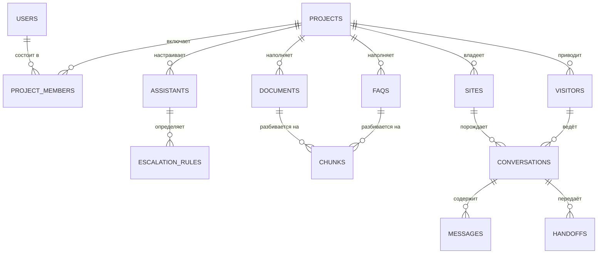

# База данных (PostgreSQL + pgvector)

## Краткое содержание

- Технологии и принципы.
- ER-диаграмма и назначение таблиц.
- Индексы.
- Векторное хранение и гибридный поиск.
- seq-нумерация.
- Мультиарендность.
- Миграции (правила + примеры).

## 1. Технологии и принципы

- **PostgreSQL 16 + расширение pgvector** — единственное постоянное хранилище: реляционные данные + векторы + полнотекстовый поиск (ADR-002). Отдельная vector DB в MVP не используется.
- Redis — только очереди/pub-sub/rate-limit (не хранилище истины; DOC-005, DOC-017).
- Идентификаторы — **UUIDv7** (сортируемые по времени, удобны для курсорной пагинации).
- Все доменные таблицы содержат `project_id` — мультиарендность (раздел 6).

## 2. ER-диаграмма



## 3. Таблицы

| Таблица | Назначение | Ключевые поля / ограничения |
|---|---|---|
| `users` | Администраторы/операторы установки | `email UK`, `password_hash` (argon2id), `installation_role` (owner/admin) |
| `projects` | Проекты (арендаторы в рамках установки) | `settings jsonb` |
| `project_members` | Членство и роли в проекте | `user_id`, `project_id`, `project_role` (project_admin/operator); UK(user, project) |
| `sites` | Сайты проекта | `domain`, `allowed_origins jsonb`, `widget_public_key UK` (publishable), `widget_config jsonb` (тема/позиция/приветствие/locale), `is_active` |
| `assistants` | Настройки AI проекта (1:1 к проекту в MVP) | `locale`, `tone`, `company_description`, `custom_instructions`, `retrieval_settings jsonb`, `safety_settings jsonb`, `widget_texts jsonb` |
| `escalation_rules` | Упорядоченные правила эскалации | `assistant_id`, `priority`, `type`, `params jsonb`, `action`, `enabled` |
| `documents` | Источники знаний: файлы/URL/текст | `source_type`, `mime`, `size_bytes`, `checksum`, `status` (pending/parsing/indexing/ready/failed), `version`, `uploaded_by` |
| `faqs` | Пары вопрос-ответ | `question`, `answer`, `enabled` |
| `chunks` | Чанки знаний (векторы) | `content`, `embedding vector(1536)`, `tsv` (генерируемый), `metadata jsonb` (page, heading, url), `embedding_model`, `source_version`; CHECK: ровно один из `source_document_id`/`source_faq_id` |
| `visitors` | Анонимные посетители | `anon_id` (localStorage сайта), `attributes jsonb` (name/email при identify), `first_seen`, `last_seen` |
| `conversations` | Диалоги | `state` (NEW/AI_ACTIVE/WAITING_OPERATOR/OPERATOR_ACTIVE/RESOLVED/CLOSED), `assigned_operator_id`, `last_seq`, `context jsonb` (url, UA, locale) |
| `messages` | Сообщения | `seq`, `role` (visitor/assistant/operator/system/note), `citations jsonb`, `confidence real`, `usage jsonb`; UNIQUE(conversation_id, seq) |
| `handoffs` | Передачи оператору | `reason`, `rule_id`, `requested_by` (ai/visitor/operator), `status` (pending/accepted/resolved/cancelled), `operator_id`, метки времени |
| `events` | Append-only аудит | `actor`, `action`, `entity`, `payload jsonb`, `ip`; записи только добавляются |
| `settings` | Настройки установки | ключ-значение; секретные значения — AES-256-GCM (ключ шифрования из `APP_SECRET`) |

Проектировочные замены против исходного списка сущностей брифа (без отдельных `widget`, `admins`, `operators`, `knowledge_base`, `ai_settings`) — обоснование в DOC-026.

## 4. Индексы

| Индекс | Таблица | Под сценарий |
|---|---|---|
| `(project_id, state, last_message_at DESC)` | conversations | операторский inbox |
| `UNIQUE (conversation_id, seq)` | messages | порядок и кэтч-ап |
| HNSW (`embedding vector_cosine_ops`) | chunks | векторный поиск |
| GIN (`tsv`) | chunks | полнотекстовый поиск |
| `(project_id, source_document_id)` | chunks | удаление/переиндексация документа |
| `(status, priority)` | escalation_rules | порядок применения |
| GIN (`payload`) | events | поиск по аудиту (V2: партиционирование по дате) |

## 5. Векторное хранение и гибридный поиск

- Колонка `embedding vector(1536)` (text-embedding-3-small по умолчанию; размерность фиксирована индексом HNSW).
- **Смена модели эмбеддингов = полная переиндексация**: модель записана в каждой строке (`embedding_model`); воркер-джоба переиндексирует по проектам (DOC-012).
- Гибридный поиск: векторный (top-20) + полнотекстовый (top-20) → слияние RRF:

```sql
WITH vec AS (
  SELECT id, row_number() OVER (ORDER BY embedding <=> $1::vector) AS rank
  FROM chunks
  WHERE project_id = $2
  ORDER BY embedding <=> $1::vector
  LIMIT 20
),
fts AS (
  SELECT id, row_number() OVER (ORDER BY ts_rank(tsv, q) DESC) AS rank
  FROM chunks, websearch_to_tsquery('simple', $3) q
  WHERE project_id = $2 AND tsv @@ q
  LIMIT 20
)
SELECT c.id, c.content, c.metadata,
       COALESCE(1.0/(60+v.rank), 0) + COALESCE(1.0/(60+f.rank), 0) AS rrf_score
FROM chunks c
LEFT JOIN vec v ON v.id = c.id
LEFT JOIN fts f ON f.id = c.id
WHERE v.id IS NOT NULL OR f.id IS NOT NULL
ORDER BY rrf_score DESC
LIMIT $4;   -- top-K ассистанта
```

`tsv` генерируется конфигурацией `'simple'` в примере; для ru/en применяется соответствующая stemming-конфигурация (настройка проекта). Все запросы фильтруются по `project_id` — изоляция арендаторов на уровне данных.

## 6. Мультиарендность

- `project_id` присутствует во всех доменных таблицах; каждый запрос фильтруется по проекту в сервисном слое (двойной слой с guard'ами прав — DOC-015).
- V2 hardening: Row-Level Security по `project_id` (current_setting).

## 7. seq-нумерация сообщений

```sql
-- Атомарная выдача seq в транзакции вставки сообщения
UPDATE conversations SET last_seq = last_seq + 1 WHERE id = $1 RETURNING last_seq;
-- затем INSERT messages(..., seq = <полученное>)
```

Гарантии: отсутствие гонок (UNIQUE-констрейнт — страховка), монотонный порядок для кэтч-апа `?after_seq=N`.

## 8. Миграции

Инструментарий: стандартный мигратор NestJS/Node (таблица `schema_migrations`, advisory lock). Правила:

1. Применяются api-процессом на старте (только один применяющий — advisory lock).
2. **Экспансивные и backward-compatible:** добавить колонку/таблицу можно; удалить/переименовать — только через 2 минорные версии (старый код должен работать на новой схеме).
3. Каждая миграция идёт вместе с pre-update бэкапом (DOC-020).

Пример миграции:

```sql
-- 0007_messages_citations.sql
ALTER TABLE messages ADD COLUMN citations jsonb;
-- backward-compatible: старый код не пишет колонку, новый — читает с NULL-чеком
```

Пример отката (для документирования):

```sql
-- 0007_messages_citations.down.sql
ALTER TABLE messages DROP COLUMN IF EXISTS citations;
-- допустимо только пока ни одна выпущенная версия не полагается на колонку обязательной
```

## Чек-лист изменения схемы

- [ ] `project_id` присутствует в новой доменной таблице?
- [ ] Индексы под сценарии чтения добавлены?
- [ ] Миграция backward-compatible (экспансивная)?
- [ ] Обновлена ER-диаграмма/таблицы в этом документе?
- [ ] Удаление/переименование — отложено на 2 версии?

## Частые ошибки

- **Отдельная таблица `widgets`** — конфигурация виджета живёт в `sites.widget_config` (см. DOC-026).
- **Смена размерности эмбеддингов «на месте»** — HNSW индекс фиксирован на 1536; смена модели = переиндексация.
- **Поиск по chunks без фильтра `project_id`** — утечка знаний между арендаторами.
- **Удаление колонок сразу** — ломает откат на предыдущий образ (см. DOC-020).
- **Правила эскалации JSON-blob'ом в assistants** — теряются приоритеты/валидация; только таблица `escalation_rules`.

## Связанные разделы

- Backend и seq-механика — DOC-005
- Пайплайн знаний и переиндексация — DOC-012
- Миграции и обновления — DOC-020
- Изоляция данных и RLS — DOC-015
