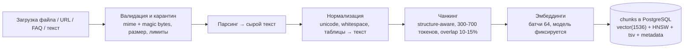
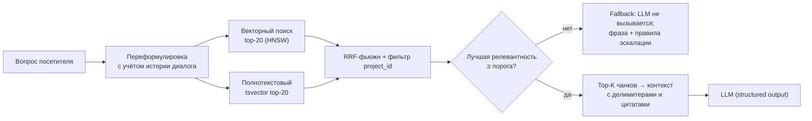

# База знаний

## Краткое содержание

- Типы источников.
- Ingest-пайплайн (асинхронный, worker).
- Чанкинг и метаданные.
- Онлайн-retrieval.
- Версии, переиндексация, удаление.
- Качество и покрытие.

## 1. Типы источников (реализовано в Ф3)

| Тип | Механика | Особенности |
|---|---|---|
| PDF | upload → pdfjs-dist | текстовый слой обязателен; скан без слоя → честный статус `failed: no text layer` (OCR — V2) |
| DOCX | upload → mammoth | таблицы/списки нормализуются |
| TXT / Markdown | upload / вставка | md-заголовки участвуют в чанкинге |
| CSV | upload | строка → структурированная запись (основа будущих «товаров») |
| URL | fetch (SSRF-защита) → HTML → санитизация → текст | глубина обхода — опция; переобход по расписанию — V2 |
| FAQ | пары вопрос-ответ в UI | пара → чанк с повышенным весом в полнотекстовом поиске |
| Текст | вставка в UI | как документ без файла |

Лимиты: 25 МБ/файл, лимит документов на проект — настройка установки. Файлы и
текстовые документы сохраняются в `uploads/{documentId}` (стабильное имя —
переиндексация читает файл); дедупликация по checksum (поле, автопроверка — V2).
Парсеры (apps/api/src/knowledge/parsers.ts): txt/md/csv/html — чистый JS;
pdf — pdfjs-dist (текст-слой обязателен, иначе честный `failed`); docx — mammoth.

**Очередь ingest (IR-024):** до Redis — последовательная in-process очередь
(concurrency 1) в api; перенос в worker/BullMQ при `REDIS_URL` — Ф4/7.
Риск признания: рестарт в момент парсинга оставит статус `parsing` (лечится
переиндексацией; BullMQ снимает в Ф4).

## 2. Ingest-пайплайн (worker, очередь `ingest`)



Статусы документа (видны в админке, с текстом ошибки):

```json
{ "status": "indexing", "version": 3,
  "error": null }
```

`pending → parsing → indexing → ready | failed` — переходы пишет воркер; ошибки не роняют процесс (изоляция джоб, DOC-005).

## 3. Чанкинг и метаданные

- Разрывы по структуре (заголовки/секции), не посреди таблицы; 300–700 токенов, overlap 10–15%.
- metadata чанка: `{source_type, document_id, page, heading, url, source_version}` — источник цитат [n] в ответах AI.
- FAQ-чанк: вопрос+ответ вместе; повышенный вес в полнотекстовом ранжировании.

## 4. Онлайн-retrieval (в запросе посетителя)



SQL гибридного поиска — DOC-006 §5 (источник истины). Порог релевантности и top-K — настройки ассистента (retrieval_settings).

## 5. Версии, переиндексация, удаление

| Операция | Механика |
|---|---|
| Правка/замена документа | `version+1`; чанки новой версии индексируются в фоне; по готовности — атомарный swap (READ старых → READ новых), старые вектора удаляются |
| Смена embedding-модели (глобально) | Фоновая переиндексация всех проектов (модель записана в каждом чанке); до завершения — поиск продолжает работать по старым |
| Удаление документа/FAQ | Каскадное удаление чанков **в той же транзакции** (преимущество pgvector) |
| Переиндексация вручную | Кнопка в админке (`POST /knowledge/documents/:id/reindex`) |

## 6. Качество и покрытие

- Аналитика: топ вопросов с низкой релевантностью и топ причин эскалаций → что добавить в KB (админка, MVP).
- Eval-наборы проекта — DOC-011 §8.
- Типовые проблемы качества: сканы без текст-слоя; устаревшие цены (переиндексация URL — V2); слишком мелкий чанкинг таблиц.

## Чек-лист добавления нового формата

- [ ] Парсер в worker (очередь ingest), лимиты и magic-bytes в валидации.
- [ ] Тесты: парсинг, чанкинг, эскалация ошибки без падения.
- [ ] Тип источника в админке; строка в таблице раздела 1 этого документа.

## Частые ошибки

- **Синхронный парсинг в запросе** — только воркер/очередь.
- **Переиндексация без смены версии** — гонка чтений; только version+1 + swap.
- **Удаление чанков отдельной джобой без транзакции** — «призрачные» знания; каскад в транзакции.
- **Сканированные PDF как «загруженные успешно»** — статус честно `failed: no text layer`.

## Связанные разделы

- AI-модуль (гейт, промпт) — DOC-011
- Схема хранения chunks — DOC-006
- SSRF-защита URL — DOC-015
- Загрузка в админке — DOC-022
