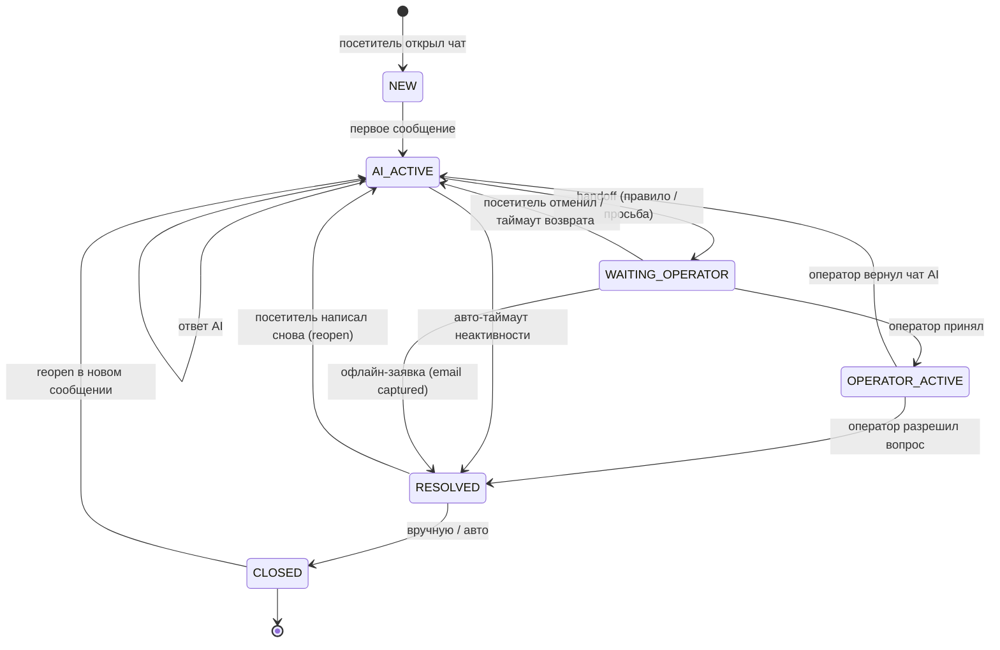
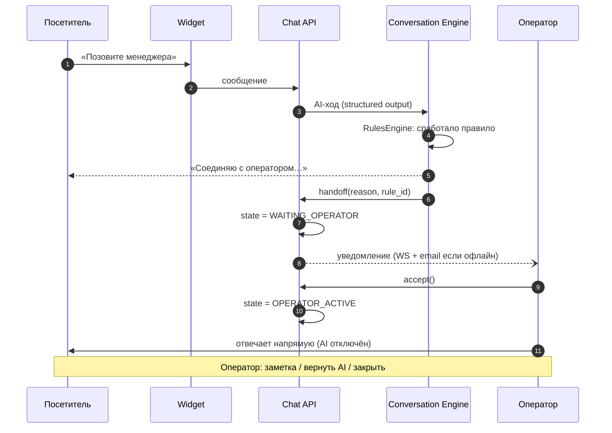

# Панель оператора

## Краткое содержание

- State machine диалога (источник истины).
- Inbox и очередь.
- Действия оператора.
- Офлайн-заявки.
- Уведомления и presence.
- Схема handoff.

## 1. State machine диалога

Правила реализации:

- Переходы валидируются сервером; незаконный → `409 INVALID_STATE_TRANSITION`.
- `PENDING_AI` — не состояние, а transient-флаг «идёт генерация» (стриминг).
- Все переходы пишутся в `events` (аудит).
- Все переходы пушатся операторам событием `conversation:state_changed` (DOC-007).

## 2. Inbox

Вкладки-очереди: **Новые / Ожидают оператора / Активные / Мои / Закрытые**.

Карточка диалога: сайт, страница входа, locale, время ожидания, причина handoff, транскрипт с AI-ответами (включая их цитаты и confidence — прозрачность решений AI).

Очередь: FIFO + приоритет «ждёт дольше всех». Фильтры: проект, сайт, состояние.

## 3. Действия оператора

| Действие | Эффект |
|---|---|
| Ответ | Сообщение от оператора (realtime); AI молчит в OPERATOR_ACTIVE |
| Внутренняя заметка | `role=note`, видна только команде, посетителю не показывается |
| Принять | `WAITING_OPERATOR → OPERATOR_ACTIVE`, `assigned_operator_id` |
| Назначить на другого | Передача `assigned_operator_id` (project_admin / оператор) |
| Вернуть AI | `→ AI_ACTIVE`: AI продолжает диалог с контекстом |
| Закрыть | `→ RESOLVED` (затем `CLOSED` вручную/авто) |
| Переоткрыть | `RESOLVED/CLOSED → AI_ACTIVE` (кнопка панели `reopen` или новое сообщение посетителя — IR-035) |

## 4. Офлайн-заявки

Handoff при отсутствии операторов онлайн: AI сообщает, что операторов нет, и предлагает оставить email. Заявка (`leave-email`) фиксируется в диалоге и `events` (`lead.captured`); контакты сохраняются в `conversations.context`, посетитель получает подтверждение; диалог → `RESOLVED`, pending-handoff отменяется. Возврат операторов не «воскрешает» диалог автоматически. Реализация Ф4: офлайн-ветка определяется по presence проекта (IR-031); офлайн-фраза — константа сервиса OFFLINE_PHRASE (персонализация widget_texts — Фаза 5, IR-037).

## 5. Уведомления и presence

- Операторы: online / offline — heartbeat по сокету, TTL 60 с, ленивая чистка (IR-031); статус away — TBD (не реализован).
- Handoff: WS-пуш в namespace `/admin` (`handoff:created`, `queue:updated`); email-напоминание, если никто не принял за N минут (settings `handoff.notify_after_min`, дефолт 5). В Ф4 транспорт консольный (DI-токен MAILER, IR-034), SMTP — Фаза 7 (D-11); повторное письмо по тому же handoff исключается событием `handoff.email_notified` (IR-033).
- Посетителю: статус «оператор онлайн/офлайн» (`presence:operators`), typing-индикатор оператора (`operator:typing`).

## 6. Схема handoff

Правила, по которым срабатывает handoff — DOC-014.

## Чек-лист изменения state machine

- [ ] Новые переходы валидируются сервером (409 на незаконные)?
- [ ] Переходы логируются в events и пушатся операторам?
- [ ] Виджет корректно отражает новое состояние (conversation:state)?
- [ ] Диаграмма в этом разделе обновлена (здесь — источник истины)?
- [ ] Проверены сценарии: офлайн, отмена, reopen после CLOSED.

## Частые ошибки

- **AI отвечает в OPERATOR_ACTIVE** — движок обязан молчать; проверять state до генерации.
- **Заметка видна посетителю** — заметка имеет `role=note` и фильтруется в выдаче виджету.
- **«Пропавший» диалог** — он в другой вкладке очереди (например, RESOLVED после офлайн-заявки).
- **Два оператора приняли одновременно** — оптимистичная конкурентность: второй получает 409/refresh.

## Связанные разделы

- Правила эскалации — DOC-014
- Пользовательская инструкция оператора — DOC-021
- События realtime — DOC-007
- Схема conversations — DOC-006
