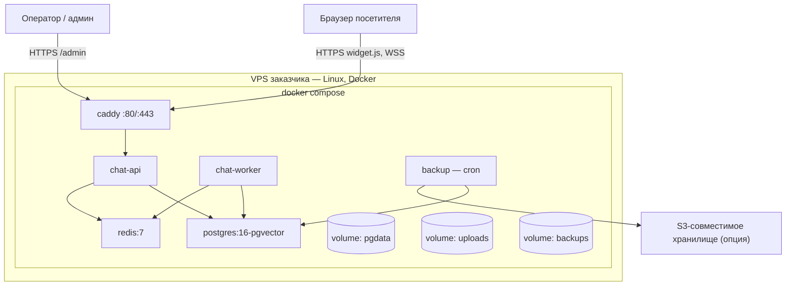

# Развёртывание

## Краткое содержание

- Требования к серверу.
- Диаграмма развёртывания.
- Состав docker compose + пример.
- Пошаговая установка.
- Проверка и диагностика.

## 1. Требования

| Параметр | Минимум | Примечание |
|---|---|---|
| VPS | 2 vCPU / 4 GB RAM / 40 GB disk | профиль ~10–50 диалогов |
| ОС | Linux x64 с Docker + Docker Compose | Ubuntu 22.04+ рекомендован |
| Домен | A-запись на IP сервера | для авто-HTTPS (Let's Encrypt) |
| Исходящий трафик | к Docker Registry (при установке/обновлении), к AI-провайдеру | |

Shared hosting для backend **не поддерживается** (WebSocket'ы, воркеры, pgvector — DOC-026 ADR-006). Сайты заказчика могут жить на любом хостинге.

## 2. Диаграмма развёртывания



Порты наружу — только 80/443 (Caddy). Postgres/Redis не публикуются (внутренняя сеть compose).

## 3. Состав docker compose

| Сервис | Образ | Роль | Лимит памяти |
|---|---|---|---|
| caddy | `caddy:2` | TLS, reverse proxy, статика | — |
| api | `chat-platform:<semver>` | REST + Socket.IO + статика; применяет миграции | 512 MB |
| worker | тот же образ, `command: node dist/worker.js` | очереди, таймеры, бэкапы | 1 GB |
| postgres | `pgvector/pgvector:pg16` | БД + векторы | — |
| redis | `redis:7-alpine` (AOF) | очереди/pub-sub/rate limit | — |
| backup | alpine + crond | pg_dump + uploads по расписанию | — |

Пример (иллюстративный; финальный файл в `infra/docker/`):

```yaml
services:
  caddy:
    image: caddy:2
    ports: ["80:80", "443:443"]
    volumes:
      - ./Caddyfile:/etc/caddy/Caddyfile
      - caddy_data:/data
    restart: unless-stopped

  api:
    image: ghcr.io/universal-chat/chat-platform:1.0.0
    command: node dist/main.js
    env_file: .env
    volumes: [uploads:/app/uploads]
    depends_on:
      postgres: { condition: service_healthy }
      redis: { condition: service_started }
    restart: unless-stopped
    deploy: { resources: { limits: { memory: 512M } } }

  worker:
    image: ghcr.io/universal-chat/chat-platform:1.0.0
    command: node dist/worker.js
    env_file: .env
    volumes: [uploads:/app/uploads, backups:/app/backups]
    depends_on:
      postgres: { condition: service_healthy }
      redis: { condition: service_started }
    restart: unless-stopped
    deploy: { resources: { limits: { memory: 1G } } }

  postgres:
    image: pgvector/pgvector:pg16
    environment:
      POSTGRES_DB: unichat
      POSTGRES_USER: unichat
      POSTGRES_PASSWORD: ${DB_PASSWORD}
    volumes: [pgdata:/var/lib/postgresql/data]
    healthcheck:
      test: ["CMD-SHELL", "pg_isready -U unichat"]
      interval: 10s
      retries: 5
    restart: unless-stopped

  redis:
    image: redis:7-alpine
    command: redis-server --appendonly yes
    restart: unless-stopped

volumes: { pgdata: {}, uploads: {}, backups: {}, caddy_data: {} }
```

Caddyfile:

```text
chat.example.com {
    reverse_proxy api:3000
}
```

## 4. Установка (пошагово)

```text
1. На VPS:
   curl -fsSL https://<репозиторий проекта>/install.sh | bash
   (альтернатива: git clone && ./install.sh — скрипт открытый)

2. Installer спрашивает: домен чат-сервера, email для Let's Encrypt
   → генерирует .env (APP_SECRET, DB_PASSWORD) с правами 600
   → docker compose pull && docker compose up -d
   → печатает одноразовый SETUP-токен

3. Открыть https://chat.example.com
   → визард: создать администратора (по токену)
   → создать проект → сайт → загрузить знания → настроить ассистента
   → скопировать сниппет / установить WP-плагин
```

Визард первого запуска — детально в DOC-022. Целевое время установки ≤ 30 минут (NFR-2).

Обновление установленной системы — DOC-020 (не через этот документ).

## 5. Проверка установки

| Проверка | Ожидание |
|---|---|
| `GET https://chat.example.com/widget/v1/health` | `200` + версия |
| Открыть админку `/admin` | логин |
| WP-плагин → «Проверить соединение» | зелёный |
| Тестовая страница со сниппетом | кнопка чата, тестовое сообщение, ответ AI |
| `docker compose ps` | все сервисы Up/healthy |

## 6. Диагностика деплоя

| Симптом | Причина | Действие |
|---|---|---|
| Caddy не выпустил сертификат | домен не указывает на IP / порт 80 закрыт | проверить A-запись, firewall |
| api перезапускается | БД не готова / неверный .env | `docker compose logs api` |
| `502 Bad Gateway` | api не поднялся | логи api; memory-лимит |
| Виджет не подключается (WS) | прокси режет upgrade | конфиг Caddy штатный; см. fallback DOC-008 §8 |
| Health ошибка БД | postgres не healthy | `logs postgres`; место на диске |
| Медленные ответы AI | провайдер/сеть | страница диагностики (DOC-019) |

## Чек-лист установки

- [ ] Домен → A-запись на сервер; порты 80/443 открыты.
- [ ] `.env` создан installer'ом; `APP_SECRET` сохранён заказчиком в менеджере паролей.
- [ ] Визард пройден: админ создан, проект/сайт есть.
- [ ] Health-check зелёный; тест-сообщение из виджета получает ответ AI.
- [ ] Первый бэкап выполнен (кнопка в админке / cron отработал).

## Частые ошибки

- **Установка backend на shared hosting** — не поддерживается (ADR-006).
- **Публикация портов Postgres/Redis наружу** — только внутренняя сеть compose.
- **Ручная правка docker-compose без обновления .env** — следующее обновление перетрёт; кастомизации через override-файл.
- **Потерянный `APP_SECRET`** — секреты настроек не расшифруются; хранить отдельно (DOC-017).

## Связанные разделы

- Архитектура минимальной конфигурации — DOC-003 §13
- Конфигурация и .env — DOC-017
- Обновления и миграции — DOC-020
- Бэкапы и восстановление — DOC-020
