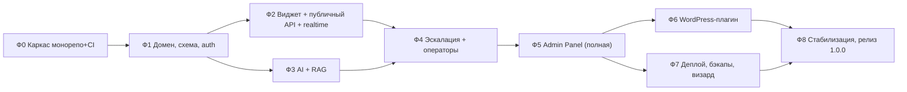

# Технический план реализации MVP

## Краткое содержание

- Стратегия: вертикальные срезы, не горизонтальные слои.
- Фазы 0–8: состав, результаты, критерии приёмки, зависимости, оценки.
- Правила процесса (ветки, PR, CI, DoD фаз).
- Суммарная оценка и контрольные точки.

## 1. Стратегия

1. **Вертикальные срезы:** каждая фаза заканчивается работающим, демонстрируемым инкрементом (можно запустить и показать), а не «готовым слоем» всего продукта. Так риск «полгода без результата» исключается структурно.
2. **Фундамент вперёд, но минимально:** монорепо, CI, dev-инфраструктура и схема БД — в первых двух фазах; всё остальное наращивается.
3. **Fake-провайдер LLM с самого начала AI-работ (фаза 3):** разработка и CI не зависят от внешнего API и денег; реальный провайдер подключается настройкой.
4. **Опасные места — раньше:** realtime-кэтч-ап (фаза 2), гейт/стриминг (фаза 3), state machine handoff (фаза 4) — это места, где архитектура может встретить реальность; они не откладываются на конец.
5. Ничего из V2/V3 в фазы не входит (DOC-025). Отклонения от состава MVP — только через изменение DOC-025 (запись в историю изменений).

## 2. Карта фаз и зависимости

Фазы 2 и 3 можно вести параллельно (после Ф1) — они почти не пересекаются по коду (widget/public API vs worker/rag).

## 3. Фазы

### Фаза 0 — Каркас монорепозитория и инфраструктуры

**Состав:**
- pnpm workspaces + Turborepo; пакеты `@uni-chat/{shared,core,api,admin,widget,ui}` по правилам зависимостей DOC-004 §4 (boundary-правила в CI).
- `apps/api`: NestJS-скелет (main/worker entrypoints), health-роут, конфиг из env, pino-логи с redaction.
- Миграционный каркас: `schema_migrations`, advisory lock, применение на старте.
- `infra/docker/docker-compose.dev.yml` (pgvector, redis) + `Dockerfile` (multi-stage, non-root).
- CI: lint + typecheck + unit + build (+ проверка размера widget-бандла — заглушка).
- README-dev, `.env.example`.

**Результат:** `pnpm install && docker compose -f infra/docker/docker-compose.dev.yml up -d && pnpm dev:api` поднимает пустой API с health; CI зелёный на пустых тестах.

**Критерии приёмки:**
- [ ] Новый разработчик поднимает окружение по DOC-023 без правок кода.
- [ ] Boundary-правила зависимостей падают в CI на демонстрационной violations-ветке.
- [ ] Образ собирается; `docker run` отдаёт health.

**Оценка (ASSUMPTION: 1 разработчик, middle+/senior TS):** 3–5 идеальных дней.

### Фаза 1 — Домен, схема БД, аутентификация

**Состав:**
- Миграции v1: `users, projects, project_members, sites, assistants, escalation_rules, visitors, conversations, messages, handoffs, documents, faqs, chunks, events, settings` (DOC-006).
- Auth: login/logout/refresh/me; argon2id; httpOnly cookie; refresh-ротация + revocation в Redis; throttling логина.
- RBAC: installation/project роли, guards + project-scope в сервисах.
- Settings + шифрование секретов (AES-256-GCM, APP_SECRET); `SETUP_TOKEN`-механика (создание первого владельца).
- Seq-механизм сообщений (`UPDATE ... RETURNING`), юнит-тесты.

**Результат:** API аутентификации и базовый CRUD проектов/сайтов работают; изоляция арендаторов тестируется.

**Критерии приёмки:**
- [ ] E2E: логин → me → CRUD проекта; чужой проект → 403 (часть E8).
- [ ] Миграции идемпотентно применяются на чистой БД и на существующей.
- [ ] Brute-force: 6-я попытка логина → 429/lockout.
- [ ] Секрет в settings не читается из БД открытым текстом.

**Оценка:** 5–8 дней.

### Фаза 2 — Виджет, публичный API, realtime

**Состав:**
- `/widget/v1`: init (origin allowlist → visitor JWT), health, conversations, messages, after_seq-кэтч-ап.
- Socket.IO gateway: namespace `/widget`, комнаты, handshake-аутентификация; Redis adapter.
- Виджет: custom element + Shadow DOM, лаунчер, панель, i18n (ru/en), темы (CSS-переменные, custom_css), стриминг-рендер (санитайзер), мобайл, identity (localStorage), SDK (`init/open/close/toggle/identify/on/setLocale/destroy`).
- Rate limit (Redis token-bucket) для widget-зон.
- Fake-AI заглушка Conversation Engine (эхо/system-ответ) — чтобы фаза была демонстрируемой целиком.

**Результат:** на тестовой HTML-странице сниппетом открывается чат; сообщения ходят с гарантией порядка и reconnect-кэтч-апом (без реального AI).

**Критерии приёмки:**
- [ ] E5 (reconnect/after_seq) зелёный; порядок сообщений сохраняется.
- [ ] Бандл ≤ 60 КБ gzip (CI enforcement включён).
- [ ] `INVALID_ORIGIN` на чужом домене; rate limit → 429 + retry_after_s.
- [ ] Мобильный вид: клавиатура не перекрывает ввод.

**Оценка:** 8–12 дней.

### Фаза 3 — AI-модуль и RAG

**Состав:**
- `LlmProvider`/`EmbeddingProvider` + `OpenAiCompatibleProvider` (chat + stream + embeddings); конфиг провайдера в settings; «проверить соединение».
- Fake-провайдер (детерминированный, эмуляция стрима/ошибок) — для тестов и CI.
- Knowledge: загрузка файлов/URL/FAQ/текста; воркер ingest (валидация, парсеры pdf/docx/csv/md/txt/html, нормализация, чанкинг, батчи эмбеддингов); статусы документов; версии + атомарный swap; каскадное удаление.
- Retrieval: гибридный поиск (HNSW + tsvector + RRF), retrieval-гейт; переформулировка вопроса по истории.
- Prompt-builder (снапшот-тесты), structured output + валидация + 1 fix-up-ретрай; стриминг `ai_token` → финальное `message` с citations/confidence.

**Результат:** полный E1 на реальном провайдере: вопрос → стриминг → ответ с цитатами; гейт отсекает вопросы вне KB.

**Критерии приёмки:**
- [ ] E1 и E2 зелёные (E1 — на fake и на реальном провайдере вручную).
- [ ] Документ-скан без текст-слоя → `failed: no text layer` (не «ready»).
- [ ] Переиндексация: version+1, swap, старые вектора удалены (E9).
- [ ] Юнит: prompt-builder снапшоты, RRF, валидатор схемы — покрытие ядра ≥ 80%.

**Оценка:** 10–15 дней (самая большая фаза; параллелится с Ф2 после Ф1).

### Фаза 4 — Эскалация и операторская подсистема

**Состав:**
- RulesEngine (типы правил DOC-014, приоритеты) + CRUD правил; signals из structured output фазы 3.
- Handoffs: создание, очередь, accept, отмена; state machine переходы (409 на незаконные) + события в `events`.
- Admin-часть inbox (первый экранный прототип админки): список по состояниям, транскрипт с цитатами AI, ответы, заметки (role=note), назначение, return-to-ai, close.
- Presence операторов; офлайн-сценарий → `leave-email`; email-уведомления (SMTP из settings, при не-принятии за N минут).
- Namespace `/admin` Socket.IO: подписки, пуш событий очереди.

**Результат:** полный цикл handoff: «позовите менеджера» → очередь → оператор отвечает → возврат AI.

**Критерии приёмки:**
- [ ] E3, E4, E6, E7 зелёные.
- [ ] Незаконный переход состояния → 409; переходы логируются.
- [ ] Два оператора на один диалог — второй получает отказ/refresh.

**Оценка:** 8–12 дней.

### Фаза 5 — Admin Panel (полная)

**Состав:**
- Страницы: dashboard (аналитика MVP), projects/sites (+ widget-конструктор со сниппетом и custom_css), AI-ассистент (все настройки + редактор правил: простой/продвинутый), knowledge UI (загрузка/статусы/переиндексация), team, settings (провайдер/SMTP/бэкапы/телеметрия-off), тестовый диалог (песочница).
- Аналитика: диалоги/сутки, handoff rate, разрешённые AI, латентность, топ низкой релевантности (из events/messages).
- i18n админки ru/en; общий api-client из shared.

**Результат:** все сценарии DOC-022 проходятся в UI без curl/postman.

**Критерии приёмки:**
- [ ] Сценарии визарда и настройки ниши (DOC-022 §1–5) — end-to-end руками за один заход.
- [ ] Сниппет с ключом копируется одной кнопкой; origins редактируются.
- [ ] Тестовый диалог в песочнице отражает поведение реального виджета.

**Оценка:** 10–14 дней.

### Фаза 6 — WordPress-плагин

**Состав:**
- `integrations/wordpress/uni-chat`: настройки, embed (wp_footer), health check, «где показывать», consent (WP Consent API), шорткод, multisite; readme.txt.
- Тест-план на чистой WP + конфликтная тема.

**Результат:** чистая WP-установка → плагин → ключ → чат работает.

**Критерии приёмки:**
- [ ] Подключение WP-сайта ≤ 5 минут руками неподготовленного пользователя (NFR-3).
- [ ] Health check зелёный; consent-режим не грузит скрипт до согласия.
- [ ] Multisite: per-site настройки работают.

**Оценка:** 4–6 дней.

### Фаза 7 — Деплой, бэкапы, визард первого запуска

**Состав:**
- `install.sh` финальный: домен/email → .env генерация → pull/up → SETUP-токен; `docker-compose.prod.yml` + Caddyfile (TLS).
- Визард первого запуска (onboarding UI поверх фазы 5): токен → админ → проект → сайт → провайдер → знания → сниппет.
- Backup-сервис: cron pg_dump + uploads, retention 7/4, S3-опция; `restore.sh` интерактивный; кнопки в админке.
- Страница диагностики (версии, статусы, очереди, последний бэкап, провайдер); email-алерты (бэкап/джобы/провайдер).
- Обновления: pre-update бэкап в скрипте, SemVer-образы, changelog в админке.

**Результат:** установка «с нуля до рабочего чата» на чистой VPS по DOC-016.

**Критерии приёмки:**
- [ ] Установка на чистой VPS ≤ 30 минут (NFR-2), засечено на реальном стенде.
- [ ] Restore из бэкапа на чистую ВМ — успешен, секреты расшифровываются (исходный APP_SECRET).
- [ ] Диагностика показывает статус всех сервисов.

**Оценка:** 5–8 дней.

### Фаза 8 — Стабилизация и релиз 1.0.0

**Состав:**
- Прогон всех e2e E1–E10; фиксы; включение их в release-CI.
- Нагрузочный тест: 50 одновременных диалогов, P95 первого токена ≤ 3 с, 1-часовой прогон без утечек.
- Security-ревью по чек-листу DOC-015 (все пункты пройдены/закрыты).
- Документация: актуализация 16/17/19/20/23/24 по факту реализации; статусы → review/approved; FAQ пополнен.
- Версия 1.0.0: changelog, тег, образ в registry; WP-плагин — ZIP.

**Критерии приёмки = DoD MVP (DOC-025 §5):** все пункты закрыты.

**Оценка:** 5–7 дней.

## 4. Сводная таблица

| Фаза | Результат | e2e | Оценка, идеальных дней |
|---|---|---|---|
| 0 Каркас | Окружение + CI + health | — | 3–5 |
| 1 Домен/auth | Схема, RBAC, изоляция | (E8 частично) | 5–8 |
| 2 Виджет+realtime | Чат без AI, кэтч-ап | E5 | 8–12 |
| 3 AI+RAG | Ответы с цитатами, гейт | E1, E2, E9 | 10–15 |
| 4 Эскалация/операторы | Полный handoff-цикл | E3, E4, E6, E7 | 8–12 |
| 5 Admin Panel | Все сценарии DOC-022 | — | 10–14 |
| 6 WP-плагин | WordPress ≤ 5 мин | — | 4–6 |
| 7 Деплой/бэкапы | Установка ≤ 30 мин | — | 5–8 |
| 8 Стабилизация | Релиз 1.0.0 | E1–E10 + DoD | 5–7 |
| **Итого** | | | **~58–87** |

Оценки — ориентиры для одного middle+/senior TS-разработчика (ASSUMPTION); параллеление Ф2/Ф3 и выделение UI-потока сокращает календарное время. Перерасход фазы > 30% — сигнал пересмотра плана (не молча терпеть).

## 5. Правила процесса

| Правило | Что это |
|---|---|
| Ветки | `feature/<фаза>-<суть>` от `main`; в `main` — только через PR |
| PR | CI зелёный + саморевью + (для core-логики) ревью заказчика/второго разработчика |
| Коммиты | Conventional Commits (DOC-023 §5) |
| DoD фазы | Критерии приёмки фазы закрыты + e2e фазы зелёные + документация затронутых разделов актуализирована |
| Скоуп | Выход за состав MVP → сначала правка DOC-025, потом код |
| Демо | Конец каждой фазы — короткая запись/демонстрация инкремента |

## 6. Контрольные точки (быстрые проверки стратегии)

- После Ф2: «виджет без AI полезен?» — нет, но realtime-риски сняты; это нормально по плану.
- После Ф3: продукт уже полезен вручную (AI-чат с цитатами, сниппет) — мягкий «внутренний релиз».
- После Ф5: продукт пригоден для первого реального сайта заказчика (pilot).
- После Ф7: пригоден для установки сторонним заказчиком без разработчика.

## Частые ошибки планирования

- **Гнать фазы слоями** («весь backend, потом весь фронт») — теряется демонстрируемость и растут риски стыков.
- **Подключать реальный LLM в тесты/CI** — только fake-провайдер (DOC-018).
- **Отложить кэтч-ап/state machine «на потом»** — это скрытые блокеры фаз 2 и 4.
- **Начинать WP-плагин до стабилизации сниппета** — плагин тонкий, его место после Ф5.
- **Тянуть V2-фичи** («это же просто») — скоуп-крип; через DOC-025.

## Связанные разделы

- Состав MVP и DoD — DOC-025
- Требования FR/NFR — DOC-002
- Тестирование и e2e-сценарии — DOC-018
- Руководство разработчика — DOC-023
